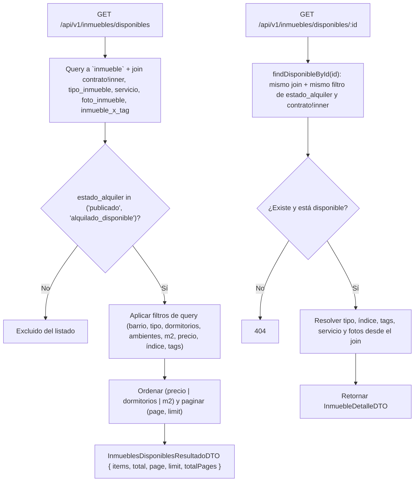
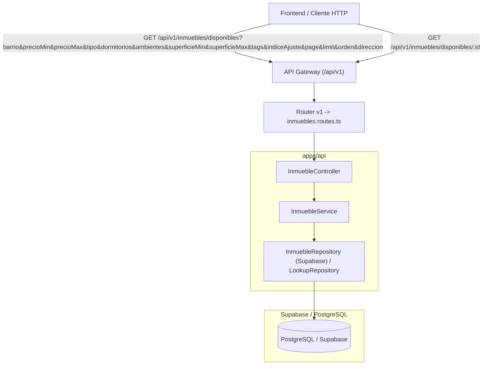

# Plan de Implementación: Consulta de Propiedades a Alquilar (RentAR)

Implementación de dos endpoints de solo lectura sobre el recurso `inmuebles`, orientados a la búsqueda pública de propiedades: un **listado de propiedades disponibles para alquilar** (con filtros, orden y paginación) y el **detalle de una propiedad puntual**. Se mantiene el mismo diseño en capas (Controlador, Servicio, Repositorio, DTO) y el API Gateway versionado (`/api/v1/`) ya existentes.

> **Actualizado (26/09):** este documento describía la primera versión de estos endpoints, contra
> repositorios en memoria y un modelo con una entidad `publicacion` separada. Esa versión ya no existe:
> el commit "Fix endpoints de consulta propiedades disponibles con nuevo modelo bdd" la reemplazó por
> la implementación actual contra Supabase/PostgreSQL, descripta acá.

---

## 1. Aclaración del Flujo y Regla de Negocio

### ¿Qué hace `GET /inmuebles/disponibles`?

Ya no hay una tabla `publicacion` ni una regla de "contrato vigente / locatario asociado": el modelo
de datos actual (`supabase/migrations/20260918000000_init_rentar_schema.sql`) guarda el estado de la
propiedad directo en `inmueble.estado_alquiler` y las condiciones comerciales en `contrato` (1:1 con
el inmueble, se crea siempre en el alta de US-01).

Un inmueble aparece en el listado si:
1. Su `estado_alquiler` es `'publicado'` o `'alquilado_disponible'` (filtro `.in(...)` en el repositorio).
2. Tiene un `contrato` asociado (`contrato!inner`): al ser un inner join, un inmueble **sin contrato
   se excluye del listado entero**, aunque su `estado_alquiler` sea válido. En la práctica esto no
   pasa porque el alta (`registrarPropiedadCompleta`) crea el contrato en la misma transacción que el
   inmueble.

Después, si vinieron filtros por query, se aplican como condiciones adicionales sobre esa misma
consulta (barrio, tipo, dormitorios, ambientes, superficie, precio, índice de ajuste, tags), y por
último el orden y la paginación.

### ¿Qué hace `GET /inmuebles/disponibles/:id`?

También se actualizó: `InmuebleService#getById` ahora llama a `inmRepo.findDisponibleById(id)` (el
mismo join enriquecido que usa `buscarDisponibles`: `contrato!inner`, `tipo_inmueble`, `servicio`,
`foto_inmueble`, `inmueble_x_tag`/`tags_inmueble`), así que el detalle queda sujeto a la misma regla
de disponibilidad que el listado — `estado_alquiler in ('publicado', 'alquilado_disponible')` +
contrato asociado. Si el inmueble no cumple esa condición, `findDisponibleById` devuelve `null` y el
controller responde 404, igual que si el `id` no existiera.

`InmuebleDetalleDTO` se amplió para que el detalle traiga los mismos datos que la tarjeta del
listado, más lo que no entra en una tarjeta: `servicio` (objeto `{id, nombre, descripcion}`) y
`fotos` (todas, no solo la principal). Ver DTOs en §3.



---

## 2. Arquitectura y Componentes



Ambas rutas siguen **sin requerir autenticación ni rol** (`authenticateGateway` / `requireRole` no se
aplican): están pensadas para consulta pública del catálogo, igual que antes.

Nota de orden de rutas: `GET /disponibles` y `GET /disponibles/:id` se registran **antes** de
`GET /:id` genérico... en realidad ya no existe un `GET /:id` genérico (se sacó de
`inmuebles.routes.ts`; solo quedan `PUT /:id` y `DELETE /:id`, protegidas). Así que el conflicto de
orden de rutas que motivaba la nota original ya no aplica.

---

## 3. Modelo de Datos y DTOs

Se sigue reutilizando el esquema existente (`inmueble`, `contrato`, `tipo_inmueble`, `servicio`,
`foto_inmueble`, `inmueble_x_tag`, `tags_inmueble`, `tipo_indice`). **No existe una tabla
`publicacion`** en el schema actual — el precio y las condiciones comerciales viven en `contrato`.

### DTOs nuevos (`apps/api/src/dtos/inmueble.dto.ts`)

- **`FiltrosInmueblesDisponiblesDTO`**: los query params que acepta el listado — `barrio`,
  `precioMin`/`precioMax`, `tipo`, `dormitorios`, `ambientes`, `superficieMin`/`superficieMax`,
  `tags` (array de ids), `indiceAjuste`, `page`, `limit`, `orden` (`precio | dormitorios | m2`),
  `direccion` (`asc | desc`).
- **`InmuebleDisponibleDTO`**: cada item del listado. Ya viene enriquecido: `tipo` e
  `indice_ajuste` como objeto `{ id, descripcion }`, `tags` como lista de `{ id, descripcion }`,
  `precio`/`expensas` (sacados del `contrato` asociado), `foto_principal` (url) y
  `fecha_disponible`. A diferencia de la versión anterior, **no hace falta pedir el detalle aparte**
  para tener precio y título.
- **`InmueblesDisponiblesResultadoDTO`**: el sobre paginado — `{ items: InmuebleDisponibleDTO[],
  total, page, limit, totalPages }`.

### DTO cambiado

- **`InmuebleDetalleDTO`**: la respuesta de `GET /inmuebles/disponibles/:id`. Antes era el inmueble
  crudo con `tipo_inmueble`/`tag`/`servicio` como texto plano; ahora tiene la misma forma que
  `InmuebleDisponibleDTO` (`tipo` e `indice_ajuste` como objeto, `tags` como lista, `precio` y
  `expensas` del `contrato`), más dos campos que el listado no necesita: `servicio` (objeto
  `{id, nombre, descripcion}` o `null`) y `fotos` (el array completo, no solo la principal).

---

## 4. Archivos Modificados (commit "Fix endpoints de consulta propiedades disponibles con nuevo modelo bdd")

```text
SEM-Alq/
└── apps/
    └── api/
        └── src/
            ├── dtos/
            │   └── inmueble.dto.ts             # + FiltrosInmueblesDisponiblesDTO
            │                                    # + InmuebleDisponibleDTO
            │                                    # + InmueblesDisponiblesResultadoDTO
            │                                    # InmuebleDetalleDTO reescrito (misma forma que InmuebleDisponibleDTO + servicio + fotos)
            ├── repositories/
            │   └── inmueble.repository.ts      # + buscarDisponibles() (contra Supabase, con filtros/orden/paginación)
            │                                    # + findDisponibleById() (mismo join, ahora sí conectado — ver §1)
            ├── services/
            │   └── inmueble.service.ts         # getInmueblesDisponibles() ahora delega en buscarDisponibles()
            │                                    # getById() ahora delega en findDisponibleById()
            ├── controllers/
            │   └── inmueble.controller.ts       # getInmueblesDisponibles() arma FiltrosInmueblesDisponiblesDTO desde req.query
            └── routes/
                └── v1/
                    └── inmuebles.routes.ts       # GET /disponibles/:id (antes GET /:id genérico)
                                                   # + doc @openapi de filtros, orden y paginación
                                                   # se sacó el GET /:id genérico sin auth
```

A diferencia de la versión anterior de este plan, acá **sí se tocó `repositories/`**: ya no hay
mocks en memoria, `buscarDisponibles` arma la consulta directo contra Supabase
(`getSupabaseAdmin()`), incluida la paginación con `.range()` y el conteo con `{ count: 'exact' }`.

---

## 5. Plan de Verificación

1. **Compilación de TypeScript**: `npm run build` en `apps/api` (o `tsc --noEmit`).
2. **Pruebas manuales / automatizadas pendientes**:
   - **`GET /api/v1/inmuebles/disponibles`**:
     - Debe excluir inmuebles con `estado_alquiler` distinto de `publicado`/`alquilado_disponible`.
     - Debe excluir inmuebles sin `contrato` asociado (no debería pasar en la práctica, ver §1).
     - Cada filtro (`barrio`, `precioMin`/`precioMax`, `tipo`, `dormitorios`, `ambientes`,
       `superficieMin`/`superficieMax`, `tags`, `indiceAjuste`) debe reducir el resultado como
       corresponde, combinados entre sí (AND).
     - `orden`/`direccion` deben ordenar por precio, dormitorios o m2, ascendente o descendente.
     - `page`/`limit` deben paginar y `total`/`totalPages` deben ser consistentes con el `count`
       real (sin los filtros de paginación).
   - **`GET /api/v1/inmuebles/disponibles/:id`**:
     - Debe devolver `tipo`, `indice_ajuste` y `tags` como objetos resueltos (no IDs sueltos).
     - Debe devolver 404 (según `error.middleware.ts`) si el `id` no existe **o** si el inmueble
       existe pero no está disponible (`estado_alquiler` fuera de `publicado`/`alquilado_disponible`,
       o sin `contrato` asociado) — confirmar que ese 404 "no encontrado" no se confunda con el 404
       real de "no existe" en el mensaje que ve el front.
   - Agregar los casos anteriores a `apps/api/tests/api/` siguiendo el patrón de
     `mis-alquileres.test.ts`.

## 6. Pendientes detectados al día de hoy

- El front (`apps/web/src/services/propiedades.service.ts`) todavía arma nombres de query distintos
  a los que acepta el back (`provincia`, `ciudad`, `barrio[]`, `tipo[]`, `dorm[]`, `amb[]`, `m2Min`,
  `m2Max`, `tag[]`, `indice`, `pagina`, `tamanioPagina` vs. los de §3) y sigue leyendo la respuesta
  vieja: hay que actualizarlo para usar `FiltrosInmueblesDisponiblesDTO` y
  `InmueblesDisponiblesResultadoDTO` tal cual quedaron.
- El back no filtra por `provincia` ni `ciudad`, solo por `barrio`.
- `'alquilado_disponible'` no está en el tipo `EstadoAlquiler` de `packages/shared-types/src/index.ts`
  (`'publicado' | 'pausado' | 'alquilado'`): confirmar si falta agregarlo ahí o si el nombre real en
  la base es otro.
- El detalle (`/disponibles/:id`) ahora exige disponibilidad para responder 200: si se quiere poder
  ver el detalle de una propiedad alquilada o pausada (por ejemplo, desde `/panel/propiedades` del
  propio locador) va a hacer falta una ruta o un método aparte, sin ese filtro.
